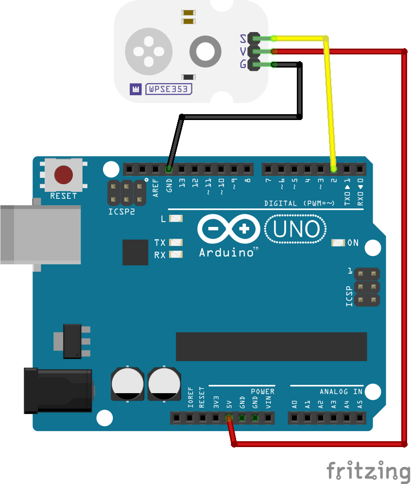

# WPSE353 Micro PIR motion sensor module

This example will print out a message and light up the built-in LED when the sensor has detected motion using an Arduino compatible board.

## Library dependencies
* None

## Wiring diagram

## Additional information
  For more information about the Whadda WPSE353 photosensitive sensor module, check the manual available at [whadda.com](https://whadda.com)